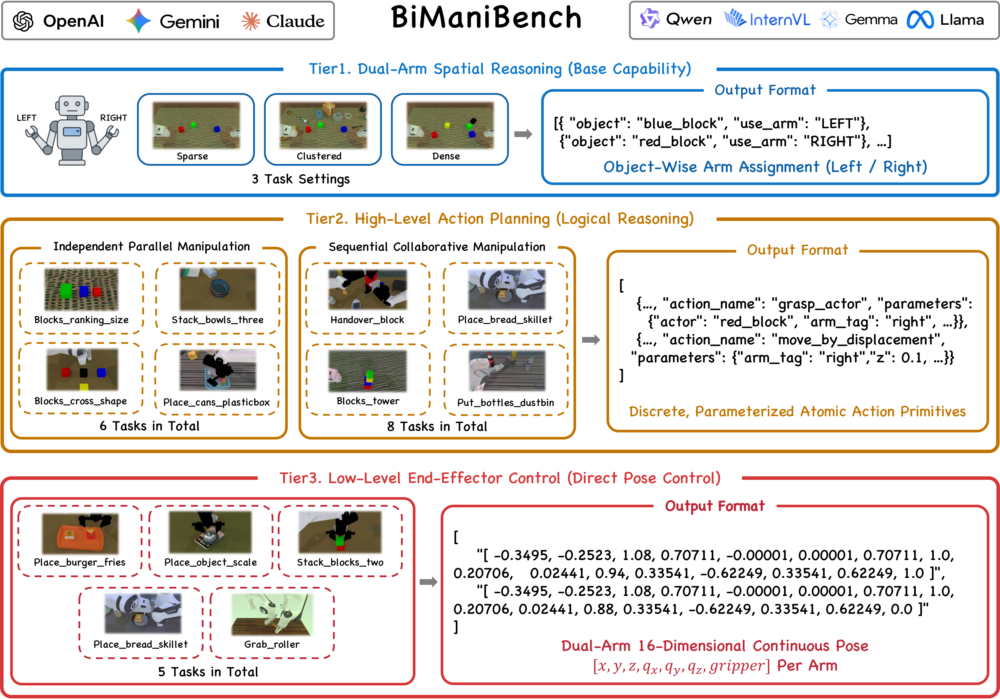

<div align="center">

<!-- 1. LOGO -->


<!-- 2. TITLE -->
<h1>BiManiBench</h1>
<p align="center">
  <b>A Hierarchical Benchmark for Evaluating Bimanual Coordination of Multimodal Large Language Models</b>
</p>

<!-- 3. AUTHORS (使用纯 HTML 确保渲染整洁) -->
<div>
  <a href="https://openreview.net/profile?id=%7EXin_Wu13">Xin Wu</a><sup>1*</sup>, 
  <a href="https://liang-zx.github.io/">Zhixuan Liang</a><sup>2*</sup>, 
  <a href="https://mayuelala.github.io/">Yue Ma</a><sup>3,4†</sup>, 
  <a href="https://aaron617.github.io/">Mengkang Hu</a><sup>2</sup>, 
  <a href="https://openreview.net/profile?id=~Zhiyuan_Qin1">Zhiyuan Qin</a><sup>4</sup>, 
  <a href="https://openreview.net/profile?id=~Xiu_Li1">Xiu Li</a><sup>1†</sup>
</div>

<!-- 4. INSTITUTIONS -->
<div style="margin-top: 10px;">
  <sup>1</sup>Tsinghua University &nbsp;&nbsp; 
  <sup>2</sup>The University of Hong Kong &nbsp;&nbsp; 
  <sup>3</sup>HKUST &nbsp;&nbsp; 
  <sup>4</sup>Beijing Innovation Center of Humanoid Robotics
</div>

<!-- 5. NOTES -->
<div style="margin-top: 5px; font-size: 0.9em;">
  <sup>*</sup>Equal Contribution &nbsp;&nbsp; <sup>†</sup>Corresponding Authors
</div>

<br>

<!-- 6. BADGES (优化后的徽章代码) -->
<a href="https://bimanibench.github.io/"></a>
<a href="https://bimanibench.github.io/"></a>
<a href="LICENSE"></a>

</div>


## 📢 News

- **[2026-02]** BiManiBench project page and preprint are released!
- **[2026-02]** Evaluation code and benchmark assets are coming soon.

---

## 💡 About BiManiBench

**BiManiBench** is the **first hierarchical benchmark** specifically designed to systematically evaluate the **bimanual coordination** capabilities of Multimodal Large Language Models (MLLMs).

While current research in embodied AI has made significant strides in single-arm manipulation, bimanual coordination remains a formidable challenge. It requires more than just parallel execution; it demands **rigorous spatiotemporal synchronization** and **dynamic role assignment** to navigate complex kinematic constraints and prevent self-collisions.

### 🌟 Key Features

- **Hierarchical Evaluation Framework:** Deconstructs bimanual tasks into three levels:
  - **Tier 1 (Dual-Arm Spatial Reasoning):** Fundamental workspace awareness and arm allocation.
  - **Tier 2 (High-Level Action Planning):** Long-horizon reasoning under diverse coordination modes (parallel & sequential).
  - **Tier 3 (Low-Level End-Effector Control):** Direct generation of fine-grained, 16-DoF continuous poses.
- **Vision-Driven Agent Pipeline:** A structured closed-loop reasoning framework where the MLLM functions as a central "brain" for iterative perception, reasoning, and action.
- **Extensive Empirical Study:** Analysis of over **30+ state-of-the-art models**, revealing a significant **"reasoning-actuation gap"** in current foundation models.

<p align="center">
  
  <br>
  <em>Figure 1: The hierarchical evaluation framework of BiManiBench.</em>
</p>

<p align="center">
  
  <br>
  <em>Figure 2: The vision-driven agent pipeline for multimodal perception and reasoning.</em>
</p>

---

## 🛠️ Installation & Quick Start

*Code release is in progress. Stay tuned!*

```bash
# Example commands (coming soon)
git clone https://github.com/bimanibench/BiManiBench.git
cd BiManiBench
bash script/_install.sh
```


## 🖋️ Citation

**If you find BiManiBench useful in your research, please cite our work:**

```
@article{wu2026bimanibench,
  author    = {Wu, Xin and Liang, Zhixuan and Ma, Yue and Hu, Mengkang and Qin, Zhiyuan and Li, Xiu},
  title     = {{BiManiBench}: A Hierarchical Benchmark for Evaluating Bimanual Coordination of Multimodal Large Language Models},
  journal   = {arXiv preprint},
  year      = {2026},
}
```
## 🤝 Acknowledgements
BiManiBench is built upon the great efforts of the open-source community. We would like to express our gratitude to the following projects:

- **[RoboTwin 2.0](https://github.com/robotwin-Platform/robotwin)**: We utilize RoboTwin 2.0 as our primary simulation platform. While the original framework is designed for evaluating VLA (Vision-Language-Action) policies, we adapted its high-quality bimanual environments, assets, and task configurations to support the direct evaluation of Multimodal Large Language Models (MLLMs). We also customized several task environments to better align with our hierarchical coordination tiers.
- **[EmbodiedBench](https://github.com/EmbodiedBench/EmbodiedBench)**: Our agent's decision-making pipeline is inspired by EmbodiedBench. We adapted its structured evaluation paradigm—originally designed for various single-arm tasks—and re-engineered the top-level logic, including environment-agent interaction and API communication, to facilitate bimanual manipulation within the RoboTwin.

We sincerely thank the authors of these projects for their pioneering contributions to the field.